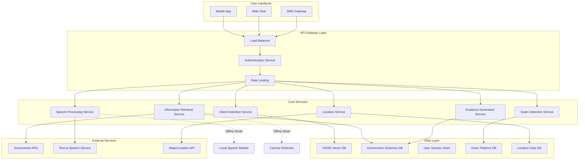

# Design Document: Government Voice Assistant

## Overview

The Government Voice Assistant is a multi-modal AI system designed to provide accessible government service information to rural, elderly, and low-literacy users. The system employs a voice-first architecture with fallback text interfaces, leveraging both cloud-based and offline speech processing capabilities to ensure accessibility in low-bandwidth environments.

The architecture follows a microservices pattern with clear separation between speech processing, natural language understanding, information retrieval, and user interface layers. This design enables platform-agnostic deployment across mobile apps, web interfaces, and SMS gateways while maintaining consistent functionality.

## Architecture



The system employs a hybrid cloud-edge architecture where critical components can operate offline using cached data and local models, while online components provide enhanced accuracy and real-time government data updates.

## Components and Interfaces

### Speech Processing Service

**Responsibilities:**
- Convert speech to text using Whisper (online) and Vosk (offline)
- Convert text responses to speech using cloud TTS and local TTS
- Handle multiple regional languages with dialect variations
- Manage audio quality optimization for low-bandwidth scenarios

**Key Interfaces:**
```python
class SpeechProcessor:
    def speech_to_text(audio_data: bytes, language: str, mode: ProcessingMode) -> TranscriptionResult
    def text_to_speech(text: str, language: str, voice_profile: str) -> AudioData
    def detect_language(audio_data: bytes) -> LanguageDetection
    def optimize_for_bandwidth(audio_data: bytes, bandwidth: int) -> bytes
```

**Implementation Details:**
- Primary engine: OpenAI Whisper Large-v3 for cloud processing
- Fallback engine: Vosk with language-specific models for offline processing
- Language support: Hindi, Tamil, Telugu, Bengali, Marathi, Gujarati, Kannada, Malayalam, Punjabi, Odia
- Audio preprocessing includes noise reduction and normalization
- Adaptive quality based on network conditions

### Intent Detection Service

**Responsibilities:**
- Parse natural language queries to identify user intent
- Extract entities (scheme names, locations, document types)
- Handle colloquial expressions and regional variations
- Maintain conversation context across interactions

**Key Interfaces:**
```python
class IntentDetector:
    def detect_intent(text: str, context: ConversationContext) -> IntentResult
    def extract_entities(text: str, intent: Intent) -> EntityList
    def update_context(context: ConversationContext, new_intent: Intent) -> ConversationContext
    def handle_ambiguity(text: str, possible_intents: List[Intent]) -> ClarificationRequest
```

**Implementation Details:**
- Primary NLP: GPT-4 with custom prompts for government domain
- Entity extraction using named entity recognition for Indian government schemes
- Context management using conversation memory with 10-turn history
- Fallback to rule-based classification for offline scenarios

### Information Retrieval Service

**Responsibilities:**
- Search government schemes using semantic similarity
- Fetch real-time data from government APIs
- Maintain cached scheme database for offline access
- Validate information authenticity and freshness

**Key Interfaces:**
```python
class InformationRetriever:
    def search_schemes(query: str, user_profile: UserProfile) -> List[SchemeResult]
    def get_scheme_details(scheme_id: str) -> SchemeDetails
    def check_eligibility(scheme: Scheme, user_profile: UserProfile) -> EligibilityResult
    def update_scheme_cache() -> CacheUpdateResult
```

**Implementation Details:**
- Vector database: FAISS with sentence-transformers embeddings
- Government data sources: Direct API integration with major schemes (PM-KISAN, Ayushman Bharat, etc.)
- Semantic search using multilingual sentence embeddings
- Daily automated updates from official government portals
- Offline cache maintains 500+ most common schemes with full details

### Guidance Generation Service

**Responsibilities:**
- Create step-by-step application guidance
- Adapt instructions based on user literacy level
- Generate document checklists and requirements
- Provide alternative pathways for complex processes

**Key Interfaces:**
```python
class GuidanceGenerator:
    def generate_steps(scheme: Scheme, user_profile: UserProfile) -> StepByStepGuide
    def simplify_language(text: str, literacy_level: LiteracyLevel) -> str
    def create_checklist(scheme: Scheme) -> DocumentChecklist
    def get_alternative_paths(scheme: Scheme, user_constraints: List[str]) -> List[AlternativePath]
```

**Implementation Details:**
- Template-based guidance generation with dynamic content insertion
- Language simplification using readability metrics and vocabulary adaptation
- Multi-modal output supporting text, audio, and visual aids
- Integration with location service for nearest service center recommendations

### Scam Detection Service

**Responsibilities:**
- Identify potential fraud indicators in user queries
- Validate authenticity of government scheme information
- Detect and flag suspicious communication patterns
- Educate users about common scam tactics

**Key Interfaces:**
```python
class ScamDetector:
    def analyze_query(query: str, context: ConversationContext) -> ThreatAssessment
    def validate_scheme_authenticity(scheme_info: str) -> AuthenticityResult
    def detect_fraud_patterns(conversation_history: List[Message]) -> FraudAlert
    def generate_safety_tips(threat_type: ThreatType) -> SafetyGuidance
```

**Implementation Details:**
- Machine learning classifier trained on known scam patterns
- Real-time validation against official government scheme databases
- Pattern recognition for common fraud indicators (urgent payments, unofficial contacts)
- Integration with government fraud reporting systems

## Data Models

### Core Entities

```python
@dataclass
class UserProfile:
    user_id: str
    preferred_language: str
    literacy_level: LiteracyLevel
    location: Location
    accessibility_needs: List[AccessibilityFeature]
    interaction_history: List[Interaction]

@dataclass
class GovernmentScheme:
    scheme_id: str
    name: str
    description: str
    eligibility_criteria: List[Criterion]
    required_documents: List[Document]
    application_process: List[Step]
    official_source: str
    last_updated: datetime
    embedding_vector: np.ndarray

@dataclass
class ConversationContext:
    session_id: str
    user_profile: UserProfile
    current_intent: Intent
    conversation_history: List[Message]
    active_scheme: Optional[GovernmentScheme]
    progress_state: Dict[str, Any]

@dataclass
class TranscriptionResult:
    text: str
    confidence: float
    language_detected: str
    processing_time: float
    error_indicators: List[str]
```

### Database Schema

**Government Schemes Collection:**
- Primary key: scheme_id
- Indexed fields: category, state, eligibility_keywords
- Full-text search on: name, description, keywords
- Vector embeddings for semantic search

**User Sessions Collection:**
- Primary key: session_id
- TTL: 24 hours for privacy
- Indexed on: user_id, created_at
- Stores conversation context and progress

**Scam Patterns Collection:**
- Pattern signatures and classification labels
- Regular expression patterns for text analysis
- Threat severity levels and response templates

## Correctness Properties

*A property is a characteristic or behavior that should hold true across all valid executions of a system—essentially, a formal statement about what the system should do. Properties serve as the bridge between human-readable specifications and machine-verifiable correctness guarantees.*

Before defining the correctness properties, I need to analyze the acceptance criteria from the requirements to determine which ones are testable as properties.

### Property 1: Speech Processing Round Trip
*For any* supported regional language and valid text input, converting text to speech and then back to text should preserve the essential meaning and key information, with speech-to-text accuracy maintaining at least 85% for clear audio inputs.
**Validates: Requirements 1.1, 1.3**

### Property 2: Comprehensive Language Support  
*For any* of the 10 supported regional languages (Hindi, Tamil, Telugu, Bengali, Marathi, Gujarati, Kannada, Malayalam, Punjabi, Odia) and their regional dialects, the system should successfully process voice input, detect intent, and provide appropriate responses.
**Validates: Requirements 1.4, 8.2**

### Property 3: Verified Information Sources
*For any* government scheme information provided to users, all data should originate from verified government databases or APIs, include official source attribution and last updated timestamps, and pass scam detection validation.
**Validates: Requirements 2.1, 2.2, 6.2**

### Property 4: Intent Detection Robustness
*For any* user query expressed in natural language (including colloquial, indirect, or ambiguous phrasing), the system should either correctly identify the intent or request appropriate clarification, and provide helpful examples when queries cannot be understood.
**Validates: Requirements 1.2, 8.1, 8.3, 8.5**

### Property 5: Step-by-Step Guidance Completeness
*For any* government scheme application process, the generated guidance should be broken into discrete, manageable steps with simple language, complete document checklists, and require user acknowledgment before progression.
**Validates: Requirements 3.1, 3.2, 3.3, 3.4**

### Property 6: Cross-Platform Consistency
*For any* core functionality query, the response should provide equivalent information and capabilities across mobile app, web chat, and SMS interfaces, with platform-appropriate formatting and automatic platform detection.
**Validates: Requirements 4.1, 4.4**

### Property 7: Connectivity Adaptation
*For any* network condition (high bandwidth, low bandwidth, or offline), the system should automatically adapt its operation mode, maintain essential functionality, and properly sync data when connectivity is restored.
**Validates: Requirements 5.1, 5.2, 5.3, 5.4, 5.5**

### Property 8: Fraud Detection and Prevention
*For any* user interaction or information request, the system should analyze for fraud indicators, validate information authenticity, maintain updated scam pattern databases, and provide appropriate warnings and education.
**Validates: Requirements 6.1, 6.3, 6.4, 6.5**

### Property 9: Location-Based Service Discovery
*For any* user location (GPS coordinates or manually provided district/village), the system should identify relevant nearby government services, provide complete contact information and directions using landmarks, and maintain current availability status.
**Validates: Requirements 7.1, 7.2, 7.3, 7.4, 7.5**

### Property 10: Context and Session Management
*For any* user session, the system should maintain conversation context, remember user preferences and progress across sessions, handle session resumption after breaks, and allow users to clear their data while following privacy guidelines.
**Validates: Requirements 9.1, 9.2, 9.3, 9.4, 9.5**

### Property 11: Comprehensive Accessibility Support
*For any* user with disabilities or accessibility needs, the system should provide appropriate accommodations including adjustable speech parameters, alternative input methods, visual accessibility options, simplified interaction modes, and compliance with accessibility standards.
**Validates: Requirements 10.1, 10.2, 10.3, 10.4, 10.5**

### Property 12: Data Completeness and Freshness
*For any* government scheme in the database, the record should include complete eligibility criteria, application processes, required documents, and be updated at least daily from official sources with proper unavailability handling.
**Validates: Requirements 2.3, 2.4, 2.5**

### Property 13: SMS Response Optimization
*For any* response delivered via SMS interface, the content should fit within SMS character limits while preserving essential information and maintaining equivalent functionality to other platforms.
**Validates: Requirements 4.2**

### Property 14: Adaptive User Assistance
*For any* user difficulty or confusion during the application process, the system should provide alternative explanations, offer human assistance connections, and improve recognition accuracy through learning from interactions.
**Validates: Requirements 3.5, 8.4**

### Property 15: Platform Feature Graceful Degradation
*For any* platform-specific feature request on an incompatible platform, the system should inform the user of the limitation and suggest appropriate alternative access methods.
**Validates: Requirements 4.5**

### Property 16: Context Preservation Across Platforms
*For any* user switching between platforms during a session, conversation context and application progress should be maintained and accessible on the new platform.
**Validates: Requirements 4.3**

### Property 17: Unclear Input Handling
*For any* unclear, incomplete, or low-quality voice input, the system should request clarification in the user's preferred language rather than making incorrect assumptions.
**Validates: Requirements 1.5**

## Error Handling

The system implements comprehensive error handling across all components:

**Speech Processing Errors:**
- Audio quality issues: Request re-recording with quality tips
- Language detection failures: Prompt user to specify language
- TTS service unavailability: Fall back to text-only responses

**Network and Connectivity Errors:**
- API timeouts: Retry with exponential backoff, fall back to cached data
- Bandwidth limitations: Automatically reduce data usage and switch to low-bandwidth mode
- Complete connectivity loss: Switch to offline mode with cached information

**Data and Information Errors:**
- Government API failures: Use cached data with staleness warnings
- Missing scheme information: Acknowledge gaps and provide alternative resources
- Data validation failures: Flag suspicious information and request verification

**User Interaction Errors:**
- Intent detection failures: Request clarification with examples
- Context loss: Offer to restart or resume from last known state
- Platform switching errors: Maintain session state and provide recovery options

**Security and Privacy Errors:**
- Fraud detection alerts: Immediately warn users and provide safety guidance
- Data privacy violations: Automatically purge sensitive data and log incidents
- Authentication failures: Gracefully degrade to public information only

## Testing Strategy

The testing approach combines comprehensive unit testing for specific scenarios with property-based testing for universal correctness validation.

**Unit Testing Focus:**
- Specific examples of successful speech-to-text conversion for each supported language
- Edge cases like very short audio clips, background noise, and multiple speakers
- Integration points between services (API calls, database queries, external service calls)
- Error conditions and recovery scenarios
- Platform-specific functionality and formatting
- Accessibility feature implementations

**Property-Based Testing Configuration:**
- Framework: Hypothesis for Python components, fast-check for any JavaScript/TypeScript components
- Minimum 100 iterations per property test to ensure comprehensive input coverage
- Custom generators for:
  - Audio samples in supported regional languages
  - Government scheme data structures
  - User profiles with various accessibility needs
  - Network condition simulations
  - Cross-platform interaction scenarios

**Property Test Implementation:**
Each correctness property will be implemented as a dedicated property-based test with the following tag format:
- **Feature: government-voice-assistant, Property 1: Speech Processing Round Trip**
- **Feature: government-voice-assistant, Property 2: Comprehensive Language Support**
- And so forth for all 17 properties

**Integration Testing:**
- End-to-end user journeys across all platforms
- Cross-service communication validation
- Performance testing under various network conditions
- Security testing for fraud detection and data privacy
- Accessibility compliance testing with assistive technologies

**Load and Performance Testing:**
- Concurrent user simulation across multiple platforms
- Speech processing latency under various loads
- Database query performance with large scheme datasets
- Bandwidth optimization validation
- Offline mode functionality under resource constraints

The dual testing approach ensures both concrete functionality validation through unit tests and universal correctness guarantees through property-based testing, providing comprehensive coverage for this critical government service system.